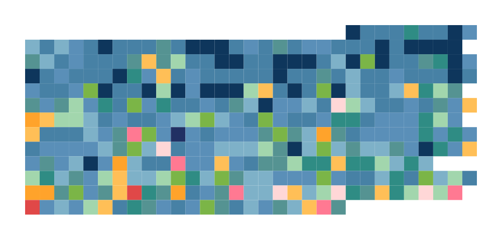

# step-stitch

Super basic tool for generating a heatmap for a temperature chart style
stitching project from an export of iOS step count data.

I threw this together as a prototype to see if a step count chart was viable, so
it's not at all flexible. It expects the input to be a json file generated by
the [Health Auto Export app](https://apps.apple.com/app/id1115567069), and it
will only export a 1000x1000 png.

Run using `yarn start <inputPath> <outputPath>`, where `inputPath` is the path
to the input json file and `outputPath` is the path to where the output png
should be saved to.

## Example output

